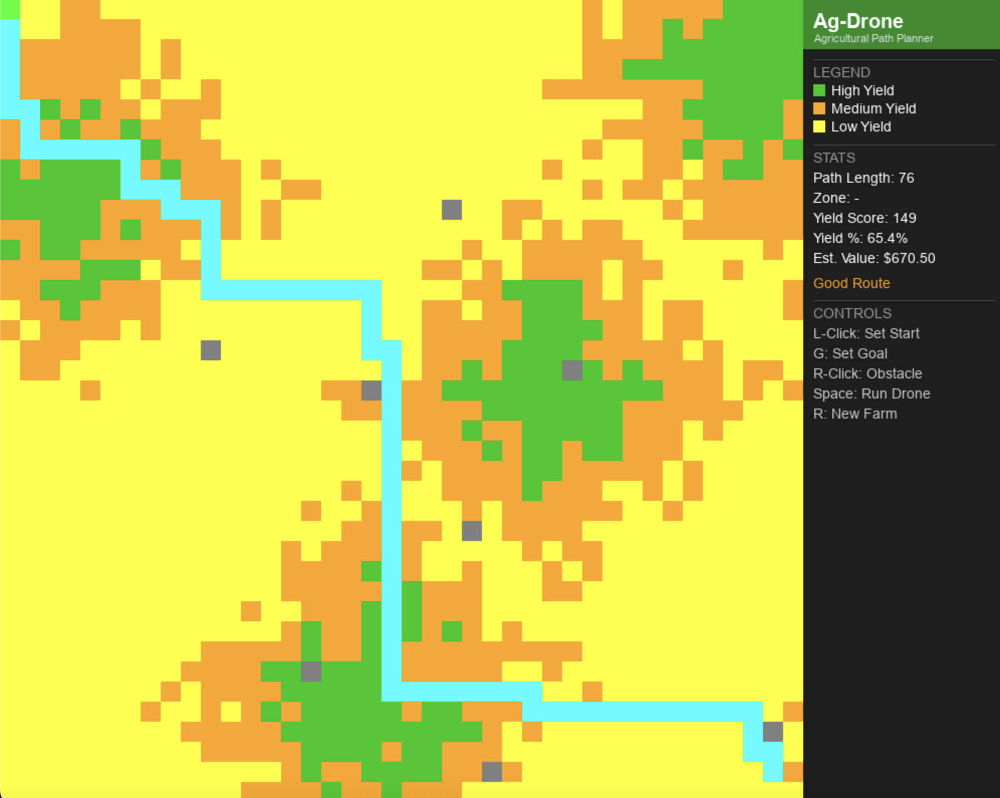
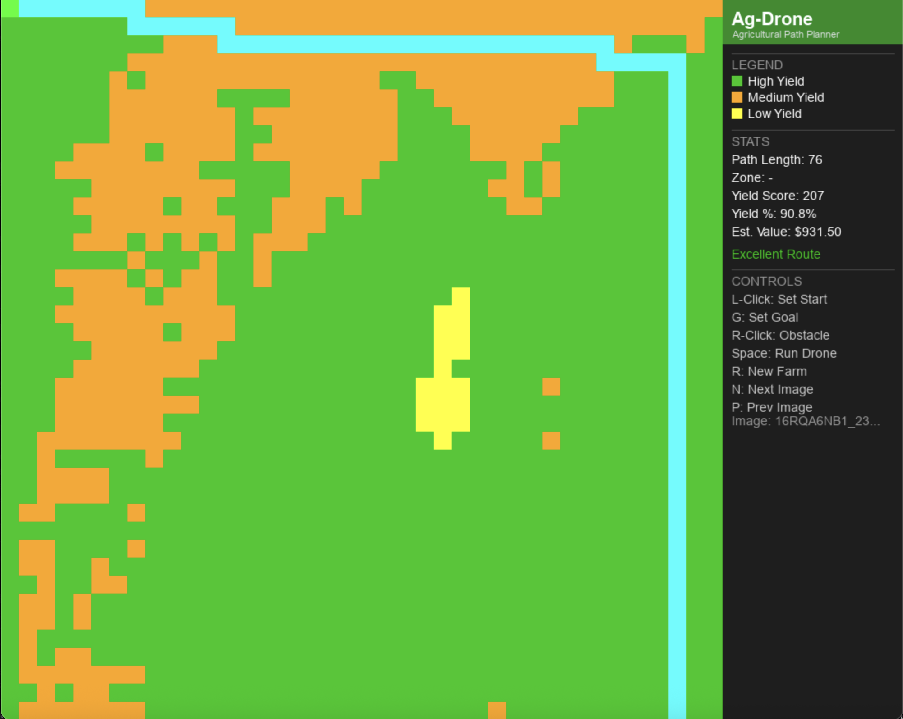

Copy

# 🚁 Ag-Drone Agricultural Path Planner
 
> A computer vision perception pipeline meets precision agriculture, processing real expert labeled aerial imagery to generate optimal harvest routes using A* pathfinding.
 

 
| Real Aerial Field Image | Perception Output |
|------------------------|-------------------|
|  |  |
 
## Overview
 
Ag-Drone is a personal project and my first step into perception engineering and autonomous systems. It processes real labeled aerial crop imagery from the Agriculture Vision CVPR research dataset, classifies field zones by yield health, and uses a custom weighted A* pathfinding algorithm to deliver optimized harvest routes.
 
The project is highly adaptable. The same pipeline could be applied to wildfire suppression routing, search and rescue, or any scenario where terrain quality affects path priority.
 
## Inspiration
 
I have always been fascinated by Agriculture Technology. Companies like **MOSS Robotics** and **Upside Robotics** are building sensors and robots that give farmers real, actionable data about their fields. I wanted to take that idea one step further, not just display farm data, but use it to compute an optimal harvest route.
 
That question became this project: *"If a drone already knows which zones are healthy, how should it plan its route?"*
 
## How It Works
 
The simulation runs in three layers.
 
**1. Perception Pipeline (perception_dataset.py)**
 
Processes real labeled aerial imagery from the Agriculture Vision CVPR dataset. For each image, the pipeline reads expert annotated binary masks for nine agricultural anomaly types and maps them to yield classifications:
 
| Anomaly | Yield Classification |
|---------|---------------------|
| Weed Cluster | Low |
| Nutrient Deficiency | Low |
| Planter Skip | Low |
| Drydown | Low |
| Storm Damage | Low |
| Water | Low |
| Waterway | Low |
| Double Plant | Medium |
| No Anomaly | High |
 
Each 512x512 pixel image is divided into a 40x40 grid. Each cell is assigned the majority yield level of its pixel region using NumPy array operations.
 
An alternative RGB based pipeline (perception.py) uses Excess Green Index analysis for processing unlabeled aerial imagery without mask files.
 
**2. Pathfinding (astar.py)**
 
A* computes the optimal route from start to goal using the yield zone map produced by the perception pipeline. Unlike standard A*, this implementation uses yield weighted traversal costs:
 
| Zone | Cost |
|------|------|
| High Yield | 0.5 |
| Medium Yield | 1.0 |
| Low Yield | 2.0 |
 
Lower cost zones are naturally preferred, routing the drone through healthier crops and away from anomaly zones without any explicit instruction to do so.
 
**3. Drone Animation (drone.py)**
 
The drone animates step by step along the computed path, leaving a trail and accumulating a live yield score as it surveys each zone.
 
## Algorithm Deep Dive
 
A* works by maintaining a priority queue of cells to explore, always picking the cell with the lowest f score next:
 
```
f(n) = g(n) + h(n)
 
g = actual cost travelled from start
h = estimated cost to goal (Manhattan distance)
```
 
The key innovation is the custom cost function. Instead of treating every cell equally, each step's cost depends on the yield level detected by the perception pipeline. This means A* naturally routes through high yield zones and away from weed clusters or nutrient deficient areas, not because it is told to, but because healthy cells are simply cheaper to traverse.
 
## Dataset
 
This project uses the **Agriculture Vision 2017 dataset** from the CVPR Agriculture Vision Workshop.
 
```bash
aws s3 cp s3://intelinair-data-releases/agriculture-vision/cvpr_paper_2020/Dataset/data2017_miniscale.tar.gz . --no-sign-request
tar -xzf data2017_miniscale.tar.gz
```
 
The dataset contains real aerial farmland images captured across the US with expert annotated anomaly masks. No AWS account required.
 
## Features
 
🗺️ **Real dataset perception** reads expert labeled Agriculture Vision CVPR imagery
 
🧠 **Yield weighted A* pathfinding** naturally avoids weed clusters and anomaly zones
 
🚁 **Drone animation** step by step path visualization with live trail
 
📊 **Live dashboard** path length, current zone, yield score, yield percentage, estimated harvest value, and route rating
 
🌾 **Route rating** Excellent, Good, or Suboptimal based on yield efficiency
 
🚧 **Obstacle placement** simulate trees, buildings, or no fly zones
 
🔄 **Procedural mode** press R for a randomized farm layout for testing
 
## How To Run
 
**Requirements:**
```bash
pip install pygame opencv-python numpy
```
 
**Download the dataset** using the AWS command above, then update the image name in `main.py`:
 
```python
yield_zones = load_from_dataset("data2017_miniscale", "YOUR_IMAGE_NAME.jpg")
```
 
**Controls:**
 
| Key | Action |
|-----|--------|
| Left Click | Place start |
| G | Place goal at cursor |
| Right Click | Place obstacle |
| Space | Run A* and animate drone |
| R | Generate procedural farm layout |
| N | Generate next image in the Agricultural Vision Dataset |
| P | Generate previous image in the Agricultural Vision Dataset |
 
## Project Structure
 
```
ag-drone/
    main.py                  Pygame simulation, rendering, and event handling
    astar.py                 A* pathfinding algorithm with yield cost weights
    perception_dataset.py    Agriculture Vision dataset pipeline
    perception.py            RGB excess green index pipeline for unlabeled imagery
    farm.py                  Procedural farm generation for testing
    drone.py                 Drone class, animation, scoring, and path tracking
    drone.png                Drone sprite
    field.jpg                Sample aerial crop image
    README.md
```
 
## Stats and Metrics
 
**Path Length** is the total number of cells in the computed route
 
**Current Zone** shows the yield level of the drone's current cell
 
**Yield Score** is the accumulated score based on zones visited where High equals 3, Medium equals 2, and Low equals 1
 
**Yield %** compares actual yield score against the maximum possible score along the route
 
**Est. Harvest Value** converts the yield score into an estimated dollar value
 
**Route Rating** labels the run as Excellent at 80% and above, Good between 60 and 80%, and Suboptimal below 60%
 
## Future Work
 
PyTorch segmentation model trained on Agriculture Vision data to predict yield zones on new unlabeled aerial images without requiring mask files
 
ROS integration to publish computed paths as ROS topics for deployment on real autonomous drone hardware
 
3D terrain mapping to visualize elevation and crop height data
 
Multi drone coordination for covering different zones simultaneously
 
## Built With
 
Python, Pygame, OpenCV, NumPy, and the A* Search Algorithm
 
Dataset: [Agriculture Vision CVPR Dataset](https://www.agriculture-vision.com/)
 
*Inspired by [MOSS Robotics](https://www.moss.ag/) and [Upside Robotics](https://www.upsiderobotics.com/), companies building the future of precision agriculture.*